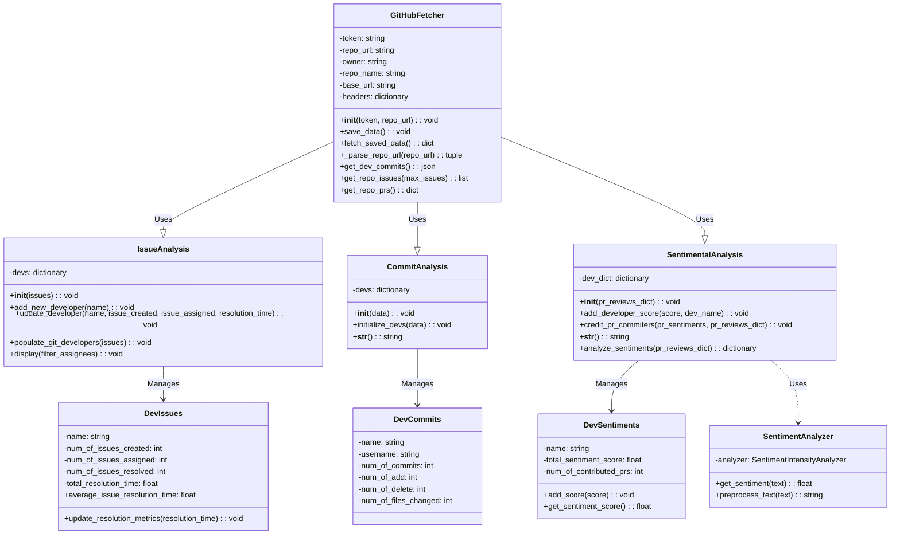

```mermaid
classDiagram
    class GitHubFetcher {
        -token: string
        -repo_url: string
        -owner: string
        -repo_name: string
        -base_url: string
        -headers: dictionary
        +__init__(token, repo_url): void
        +save_data(): void
        +fetch_saved_data(): dict
        +_parse_repo_url(repo_url): tuple
        +get_dev_commits(): json
        +get_repo_issues(max_issues): list
        +get_repo_prs(): dict
    }

    class DevIssues {
        -name: string
        -num_of_issues_created: int
        -num_of_issues_assigned: int
        -num_of_issues_resolved: int
        -total_resolution_time: float
        +average_issue_resolution_time: float
        +update_resolution_metrics(resolution_time): void
    }

    class IssueAnalysis {
        -devs: dictionary
        +__init__(issues): void
        +add_new_developer(name): void
        +update_developer(name, issue_created, issue_assigned, resolution_time): void
        +populate_git_developers(issues): void
        +display(filter_assignees): void
    }

    class DevCommits {
        -name: string
        -username: string
        -num_of_commits: int
        -num_of_add: int
        -num_of_delete: int
        -num_of_files_changed: int
    }

    class CommitAnalysis {
        -devs: dictionary
        +__init__(data): void
        +initialize_devs(data): void
        +__str__(): string
    }

    class DevSentiments {
        -name: string
        -total_sentiment_score: float
        -num_of_contributed_prs: int
        +add_score(score): void
        +get_sentiment_score(): float
    }

    class SentimentalAnalysis {
        -dev_dict: dictionary
        +__init__(pr_reviews_dict): void
        +add_developer_score(score, dev_name): void
        +credit_pr_commiters(pr_sentiments, pr_reviews_dict): void
        +__str__(): string
        +analyze_sentiments(pr_reviews_dict): dictionary
    }

    class SentimentAnalyzer {
        -analyzer: SentimentIntensityAnalyzer
        +get_sentiment(text): float
        +preprocess_text(text): string
    }

    GitHubFetcher --|> IssueAnalysis: Uses
    GitHubFetcher --|> CommitAnalysis: Uses
    GitHubFetcher --|> SentimentalAnalysis: Uses
    IssueAnalysis --> DevIssues: Manages
    CommitAnalysis --> DevCommits: Manages
    SentimentalAnalysis --> DevSentiments: Manages
    SentimentalAnalysis ..> SentimentAnalyzer: Uses

```