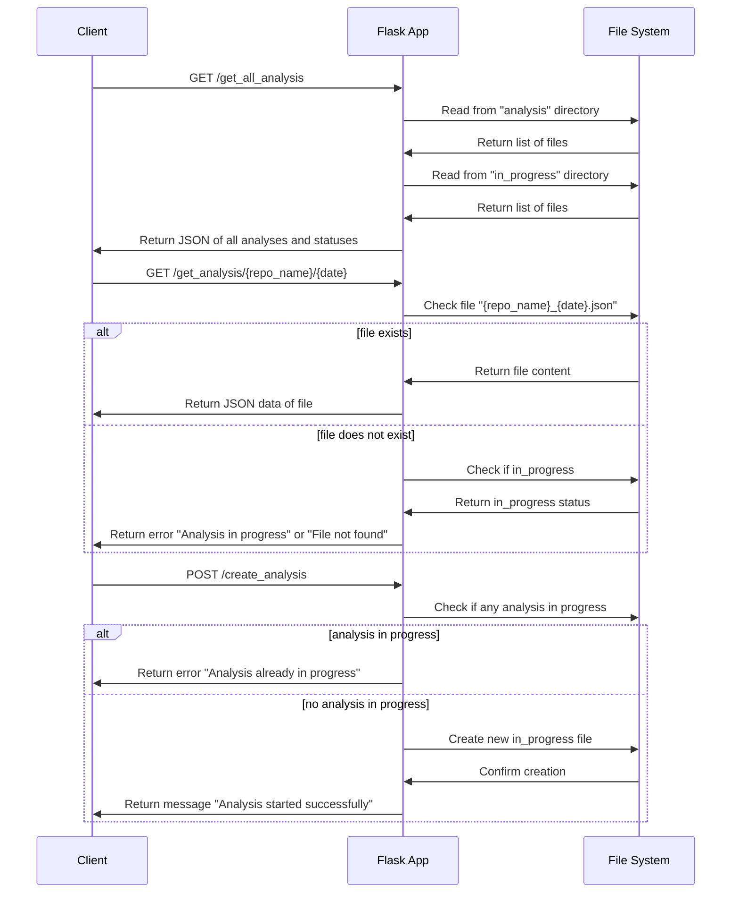

```mermaid
sequenceDiagram
    participant C as Client
    participant F as Flask App
    participant FS as File System

    C->>F: GET /get_all_analysis
    F->>FS: Read from "analysis" directory
    FS->>F: Return list of files
    F->>FS: Read from "in_progress" directory
    FS->>F: Return list of files
    F->>C: Return JSON of all analyses and statuses

    C->>F: GET /get_analysis/{repo_name}/{date}
    F->>FS: Check file "{repo_name}_{date}.json"
    alt file exists
        FS->>F: Return file content
        F->>C: Return JSON data of file
    else file does not exist
        F->>FS: Check if in_progress
        FS->>F: Return in_progress status
        F->>C: Return error "Analysis in progress" or "File not found"
    end

    C->>F: POST /create_analysis
    F->>FS: Check if any analysis in progress
    alt analysis in progress
        F->>C: Return error "Analysis already in progress"
    else no analysis in progress
        F->>FS: Create new in_progress file
        FS->>F: Confirm creation
        F->>C: Return message "Analysis started successfully"
    end
```
