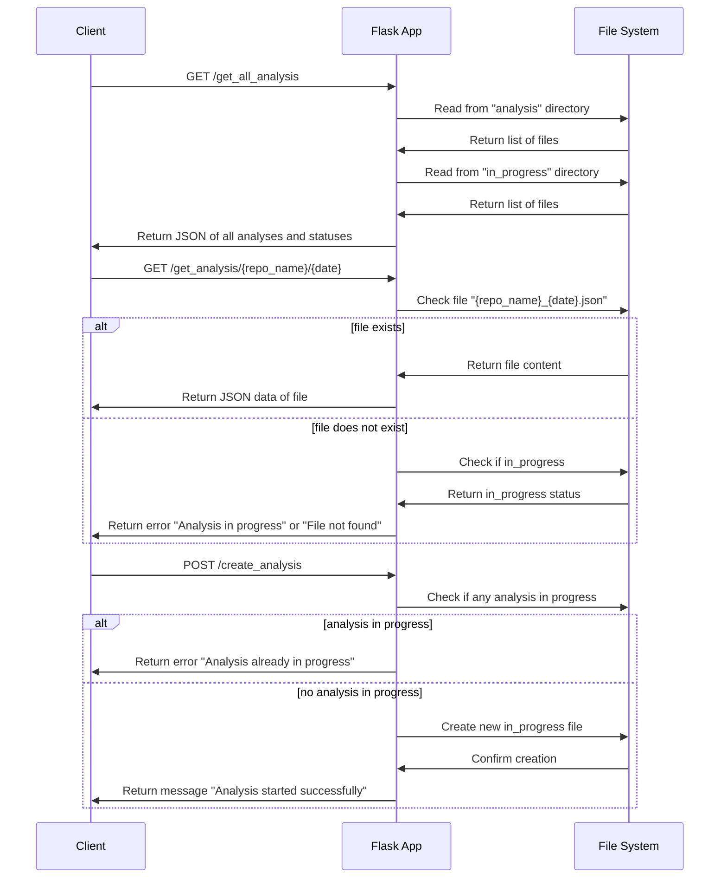

## Specification for Flask API Endpoints

### 1. GET `/get_all_analysis`
- **Description**: This endpoint retrieves a list of all repository analyses available, including those in progress.
- **Method**: GET
- **Response Format**:
  - **Success**:
    - **Status Code**: 200 OK
    - **Content**: JSON object where each key is a repository name, and the value is either a list of dates (strings) when analyses were completed or the string `"in_progress"` if an analysis is currently ongoing.
  - **Example Response**:
    ```json
    {
      "AntSimulator": ["2024-05-04"],
      "dbeaver": ["2024-05-03", "2024-05-04"],
      "glide": ["2024-05-04"],
      "glide-transformations": ["2024-05-04", "2024-05-05", "2024-05-06"],
      "gson": ["2024-05-04"],
      "hurl": ["2024-05-04"],
      "jobtalk": "in_progress"
    }
    ```
- **Errors**: None expected unless there's an issue reading the directories.

### 2. GET `/get_analysis/<string:repo_name>/<string:date>`
- **Description**: Retrieves the JSON analysis for a specified repository and date.
- **Method**: GET
- **URL Parameters**:
  - `repo_name`: The name of the repository.
  - `date`: The date of the analysis in `YYYY-MM-DD` format.
- **Response Format**:
  - **Success**:
    - **Status Code**: 200 OK
    - **Content**: JSON object containing detailed analysis data, similar to the provided example JSON.
  - **Example Response**:
    ```json
    {
      "date": "2024-05-04",
      "repo_name": "glide-transformations",
      "issues": {
        "user1": {
          "Number of Issues Created": 1,
          "Number of Issues Assigned": 0,
          "Number of Issues Resolved": 0,
          "Average Issue Resolution Time": 0
        },
        "user2": {
          "Number of Issues Created": 2,
          "Number of Issues Assigned": 0,
          "Number of Issues Resolved": 0,
          "Average Issue Resolution Time": 0
        }
      },
      "commits": {
        "Developer1": {
          "Developer Name": "Developer1",
          "GitHub Username": "dev1",
          "Number of Commits": 50,
          "Additions": 1000,
          "Deletions": 500,
          "Files Changed": 10
        },
        "Developer2": {
          "Developer Name": "Developer2",
          "GitHub Username": "dev2",
          "Number of Commits": 30,
          "Additions": 800,
          "Deletions": 300,
          "Files Changed": 8
        }
      },
      "prs": {
        "Contributor1": {
          "Sentiment Score": 0.75,
          "PRs Contributed": 5
        },
        "Contributor2": {
          "Sentiment Score": 0.65,
          "PRs Contributed": 3
        }
      }
    }
    ```
  - **Errors**:
    - **File Not Found**:
      - **Status Code**: 404 Not Found
      - **Content**: `{"error": "File not found"}`
    - **Analysis in Progress**:
      - **Status Code**: 404 Not Found
      - **Content**: `{"error": "Analysis is in progress for this repository"}`

### 3. POST `/create_analysis`
- **Description**: Initiates a new analysis for the specified repository URL if no other analysis is currently in progress.
- **Method**: POST
- **Request Format**:
  - **Content-Type**: application/json
  - **Body**:
    ```json
    {
      "repo_url": "https://github.com/some_repo"
    }
    ```
- **Response Format**:
  - **Success**:
    - **Status Code**: 202 Accepted
    - **Content**: `{"message": "Analysis started successfully for <repo_name>"}`
  - **Errors**:
    - **Analysis Already in Progress**:
      - **Status Code**: 400 Bad Request
      - **Content**: `{"error": "An analysis is already in progress"}`

### Error Handling
- **General Error** (For any unexpected issues):
  - **Status Code**: 500 Internal Server Error
  - **Content**: `{"error": "An unexpected error occurred"}`


## Backend Sequence Diagram

