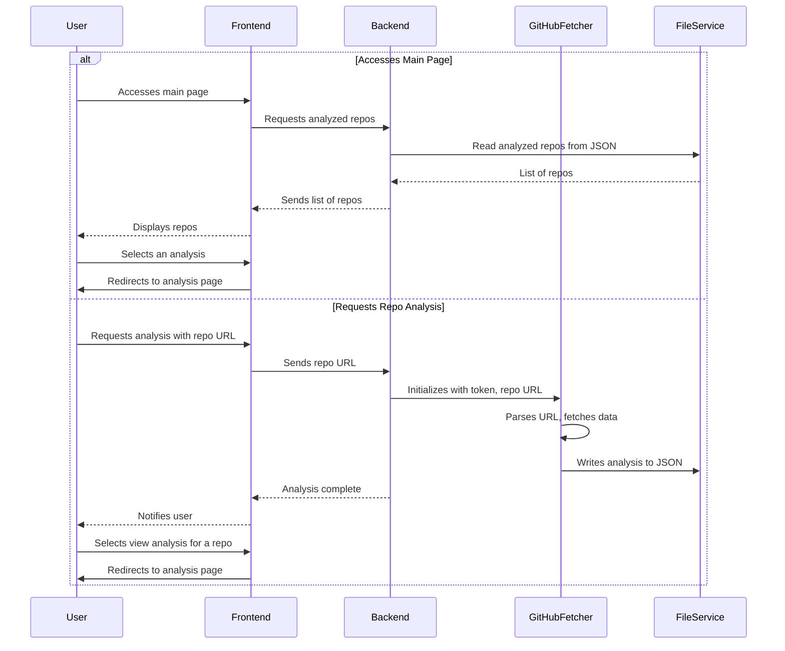
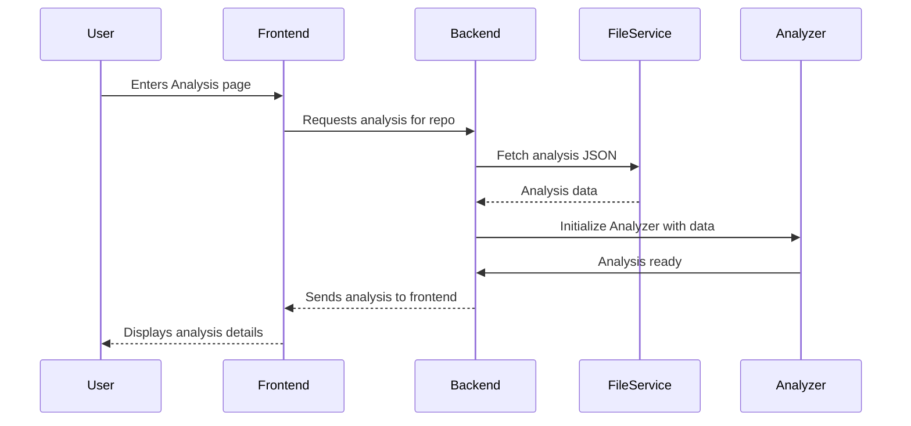

# Sequence Diagrams

## Main Page

```mermaid
sequenceDiagram
    participant U as User
    participant F as Frontend
    participant B as Backend
    participant GHF as GitHubFetcher
    participant FS as FileService

    alt Accesses Main Page
        U->>F: Accesses main page
        F->>B: Requests analyzed repos
        B->>FS: Read analyzed repos from JSON
        FS-->>B: List of repos
        B-->>F: Sends list of repos
        F-->>U: Displays repos
        U->>F: Selects an analysis
        F->>U: Redirects to analysis page
    else Requests Repo Analysis
        U->>F: Requests analysis with repo URL
        F->>B: Sends repo URL
        B->>GHF: Initializes with token, repo URL
        GHF->>GHF: Parses URL, fetches data
        GHF->>FS: Writes analysis to JSON
        B-->>F: Analysis complete
        F-->>U: Notifies user
        U->>F: Selects view analysis for a repo
        F->>U: Redirects to analysis page
end
```

## Analysis Page

```mermaid
sequenceDiagram
    participant U as User
    participant F as Frontend
    participant B as Backend
    participant FS as FileService
    participant A as Analyzer

    U->>F: Enters Analysis page
    F->>B: Requests analysis for repo
    B->>FS: Fetch analysis JSON
    FS-->>B: Analysis data
    B->>A: Initialize Analyzer with data
    A->>B: Analysis ready
    B-->>F: Sends analysis to frontend
    F-->>U: Displays analysis details

```

